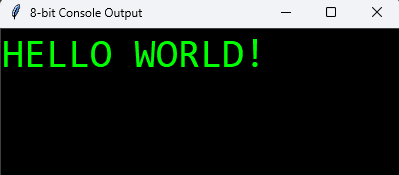

**Эмулятор 8-битного процессора** — программная модель, воспроизводящая архитектуру и поведение простого 8-битного ЦП.
Реализует базовые инструкции (арифметические, логические, переходы, работа с памятью и регистрами), циклы тактирования и
систему прерываний. Позволяет запускать и отлаживать машинный код, исследовать внутренние процессы работы процессора и
использовать его как учебный инструмент для изучения архитектуры вычислительных систем.

- [Установка проекта](#установка-проекта)
- [Эмулятор](#эмулятор)
    - [Технические характеристики](#технические-характеристики)
    - [Терминал](#терминал)
        - [Таблица символов](#таблица-символов)
        - [Инструкции процессора](#инструкции-процессора)
        - [Таблица инструкций](#таблица-инструкций)
- [Компилятор](#компилятор)
    - [Синтаксис компилятора](#синтаксис-компилятора)
    - [Формат инструкции](#формат-инструкции)
    - [Метки](#метки)
    - [Директивы данных](#директивы-данных)
    - [Комментарии](#комментарии)
    - [Правила синтаксиса](#правила-синтаксиса)

# Установка проекта

Клонируйте репозиторий в рабочую папку

```
git clone https://github.com/Misha4ca228/8bit-CPU.git
```

Перейдите в папку с проектом

```
cd 8bit-CPU
```

Запустите исполняемый файл эмулятора

```
python main.py
```

# Эмулятор

## Технические характеристики

Память: Эмулятор имеет 4096 Байт памяти, 16 последних байт предназначены для вывода символов на экран.

| Диапазон (HEX) | Диапазон (DEC) | Назначение                     |
|----------------|----------------|--------------------------------|
| 0x00 – 0xFEF   | 0 – 4079       | Основная память                |
| 0xFEF – 0xFFF  | 4079 – 4095    | Буфер вывода символов на экран |

Также эмулятор имеет 10 регистров, каждый регистр имеет память 1 байт, и PC (Program Counter) для указателя текущей
инструкции

## Терминал



Для вывода символов на экран терминала требуется загрузить код символа в соответствующую ячейку память от 0xFEF – 0xFFF(4079 – 4095).

### Таблица символов

| DEC |    BIN     | Символ |
|:---:|:----------:|:------:|
|  0  | 0b00000000 |   ␣    |
|  1  | 0b00000001 |   :    |
|  2  | 0b00000010 |   !    |
|  3  | 0b00000011 |   ?    |
|  4  | 0b00000100 |   *    |
|  5  | 0b00000101 |   -    |
|  6  | 0b00000110 |   +    |
|  7  | 0b00000111 |   /    |
|  8  | 0b00001000 |   ,    |
|  9  | 0b00001001 |   .    |
| 10  | 0b00001010 |   A    |
| 11  | 0b00001011 |   B    |
| 12  | 0b00001100 |   C    |
| 13  | 0b00001101 |   D    |
| 14  | 0b00001110 |   E    |
| 15  | 0b00001111 |   F    |
| 16  | 0b00010000 |   G    |
| 17  | 0b00010001 |   H    |
| 18  | 0b00010010 |   I    |
| 19  | 0b00010011 |   J    |
| 20  | 0b00010100 |   K    |
| 21  | 0b00010101 |   L    |
| 22  | 0b00010110 |   M    |
| 23  | 0b00010111 |   N    |
| 24  | 0b00011000 |   O    |
| 25  | 0b00011001 |   P    |
| 26  | 0b00011010 |   Q    |
| 27  | 0b00011011 |   R    |
| 28  | 0b00011100 |   S    |
| 29  | 0b00011101 |   T    |
| 30  | 0b00011110 |   U    |
| 31  | 0b00011111 |   V    |
| 32  | 0b00100000 |   W    |
| 33  | 0b00100001 |   X    |
| 34  | 0b00100010 |   Y    |
| 35  | 0b00100011 |   Z    |
| 36  | 0b00100100 |   Б    |
| 37  | 0b00100101 |   Г    |
| 38  | 0b00100110 |   Д    |
| 39  | 0b00100111 |   Ж    |
| 40  | 0b00101000 |   З    |
| 41  | 0b00101001 |   И    |
| 42  | 0b00101010 |   Л    |
| 43  | 0b00101011 |   П    |
| 44  | 0b00101100 |   Ф    |
| 45  | 0b00101101 |   Ц    |
| 46  | 0b00101110 |   Ч    |
| 47  | 0b00101111 |   Ш    |
| 48  | 0b00110000 |   Щ    |
| 49  | 0b00110001 |   Ъ    |
| 50  | 0b00110010 |   Ы    |
| 51  | 0b00110011 |   Ь    |
| 52  | 0b00110100 |   Э    |
| 53  | 0b00110101 |   Ю    |
| 54  | 0b00110110 |   Я    |
| 55  | 0b00110111 |   0    |
| 56  | 0b00111000 |   1    |
| 57  | 0b00111001 |   2    |
| 58  | 0b00111010 |   3    |
| 59  | 0b00111011 |   4    |
| 60  | 0b00111100 |   5    |
| 61  | 0b00111101 |   6    |
| 62  | 0b00111110 |   7    |
| 63  | 0b00111111 |   8    |
| 64  | 0b01000000 |   9    |
| 65  | 0b01000001 |   =    |
| 66  | 0b01000010 |   (    |
| 67  | 0b01000011 |   )    |
| 68  | 0b01000100 |   _    |
| 69  | 0b01000101 |   &    |
| 70  | 0b01000110 |   @    |
| 71  | 0b01000111 |   %    |
| 72  | 0b01001000 |   $    |
| 73  | 0b01001001 |   ~    |
| 74  | 0b01001010 |   \|   |
| 75  | 0b01001011 |   <    |
| 76  | 0b01001100 |   >    |
| 77  | 0b01001101 |   ;    |
| 78  | 0b01001110 |   ✡    |
| 79  | 0b01001111 |   ^    |
| 80  | 0b01010000 |   #    |
| 81  | 0b01010001 |   [    |
| 82  | 0b01010010 |   ]    |
| 83  | 0b01010011 |   {    |
| 84  | 0b01010100 |   }    |

## Инструкции процессора

Процессора поддерживает 29 команд. Каждая инструкция представлена одним байтом (опкодом) и может иметь один или два
операнда — регистры, адреса памяти или непосредственные значения.

Инструкции делятся на несколько категорий:

- **Работа с памятью и регистрами** — загрузка и сохранение данных.
- **Арифметические операции** — сложение, вычитание, умножение, деление.
- **Логические операции** — побитовые вычисления (AND, OR, XOR, NOT).
- **Переходы и условия** — изменение потока исполнения программы.
- **Служебные команды** — остановка процессора.

Все адреса являются 12-битными (диапазон `0–4096`).
При этом при компиляции адреса разбиваются на два байта, старший (AH) и младший (AL), например:
адрес `678` разбивается как `00000010 10100110`

## Таблица инструкций

| DEC |    BIN     | Команда  |    Аргументы     | Формат байт               | Описание                                             |
|:---:|:----------:|:--------:|:----------------:|---------------------------|------------------------------------------------------|
|  1  | 0b00000001 | **LDI**  |  r, val (8-бит)  | `[opcode][r][value]`      | Загрузить в регистр `r` константу `val`              |
|  2  | 0b00000010 |  **LD**  | r, addr (12-бит) | `[opcode][r][AH][AL]`     | Загрузить в `r` значение из памяти `addr`            |
|  3  | 0b00000011 |  **ST**  | r, addr (12-бит) | `[opcode][r][AH][AL]`     | Записать `r` в память по адресу `addr`               |
|  4  | 0b00000100 | **MOV**  |      rA, rB      | `[opcode][rA][rB]`        | Скопировать `rB → rA`                                |
|  5  | 0b00000101 | **STI**  |  r_src, r_addr   | `[opcode][src][addr_reg]` | Записать `r_src` в память по адресу `MEM[R[r_addr]]` |
|  8  | 0b00001000 | **ADD**  |      rA, rB      | `[opcode][rA][rB]`        | `rA = rA + rB`                                       |
|  9  | 0b00001001 | **ADDI** |  r, val (8-бит)  | `[opcode][r][value]`      | `r = r + val`                                        |
| 10  | 0b00001010 | **SUB**  |      rA, rB      | `[opcode][rA][rB]`        | `rA = rA - rB`                                       |
| 11  | 0b00001011 | **SUBI** |  r, val (8-бит)  | `[opcode][r][value]`      | `r = r - val`                                        |
| 12  | 0b00001100 | **MUL**  |      rA, rB      | `[opcode][rA][rB]`        | `rA = rA * rB`                                       |
| 13  | 0b00001101 | **DIV**  |      rA, rB      | `[opcode][rA][rB]`        | `rA = rA // rB`                                      |
| 14  | 0b00001110 | **MOD**  |      rA, rB      | `[opcode][rA][rB]`        | `rA = rA % rB`                                       |
| 15  | 0b00001111 | **INC**  |        r         | `[opcode][r]`             | `r = r + 1`                                          |
| 16  | 0b00010000 | **DEC**  |        r         | `[opcode][r]`             | `r = r - 1`                                          |
| 17  | 0b00010001 | **AND**  |      rA, rB      | `[opcode][rA][rB]`        | Побитовое AND                                        |
| 18  | 0b00010010 |  **OR**  |      rA, rB      | `[opcode][rA][rB]`        | Побитовое OR                                         |
| 19  | 0b00010011 | **XOR**  |      rA, rB      | `[opcode][rA][rB]`        | Побитовое XOR                                        |
| 20  | 0b00010100 | **NOT**  |        r         | `[opcode][r]`             | Побитовое NOT                                        |
| 24  | 0b00011000 | **JMP**  |  addr (12-бит)   | `[opcode][AH][AL]`        | Переход на `addr`                                    |
| 25  | 0b00011001 |  **JZ**  | r, addr (12-бит) | `[opcode][r][AH][AL]`     | Переход, если `r == 0`                               |
| 26  | 0b00011010 | **JNZ**  | r, addr (12-бит) | `[opcode][r][AH][AL]`     | Переход, если `r != 0`                               |
| 27  | 0b00011011 | **PUSH** |        r         | `[opcode][r]`             | Положить значение регистра в стек                    |
| 28  | 0b00011100 | **POP**  |        r         | `[opcode][r]`             | Снять верх стека в регистр                           |
| 255 | 0b11111111 | **HALT** |        —         | `[opcode]`                | Остановка программы                                  |

# Компилятор

Компилятор преобразует ассемблерный код пользовательской программы из файла `program.txt` в машинный байт-код, который
может быть исполнен 8-битным эмулятором.  
Он поддерживает метки, комментарии и простые директивы данных (`$`).

Компилятор выполняет два прохода:

**Первый проход** — определяет все метки и вычисляет адреса команд.

**Второй проход** — формирует итоговый массив байт, заменяя инструкции и метки на их числовые коды.

Результатом работы является список байт (до 256), готовый для загрузки в память эмулятора.

# Синтаксис компилятора

Компилятор преобразует ассемблерный код (файл `program.txt`) в 8-битный машинный код, понятный эмулятору.  
Поддерживаются **инструкции, метки, комментарии и директивы данных**.

---

## Формат инструкции

Каждая строка программы содержит **одну инструкцию** и должна заканчиваться точкой с запятой `;`.

```
ИНСТРУКЦИЯ операнд1, операнд2;
```

Примеры:

```
LDI 0, 15;        # загрузить число 15 в регистр R0 
ST 0, 240;        # сохранить R0 в ячейку памяти 0xF0 
ADD 1, 0;         # сложить R1 = R1 + R0
HALT;             # остановить выполнение
```

---

## Метки

Метки задаются в начале строки и используются для переходов (`JMP`, `JZ`, `JNZ`):

```
loop_start:     
	INC 0;     
	JNZ 0, loop_start;     
	HALT;
```

---

## Директивы данных

Для записи констант напрямую в память используется символ `$`.  
Можно записывать несколько байт на одной строке.

`$10, $0xF0, $0b11001010;`

- Поддерживаются **десятичные**, **шестнадцатеричные (`0x`)** и **двоичные (`0b`)** форматы.

- Значения должны быть в диапазоне `0–255`.

---

## Комментарии

Комментарии начинаются символом `#` и игнорируются при компиляции.

```
LDI 0, 65;  # загрузить символ 'A' 
ST 0, 240;  # вывести на экран
```

---

## Правила синтаксиса

- Каждая команда заканчивается `;`.

- Имена меток должны быть **идентификаторами** (`A–Z`, `a–z`, цифры, `_`, без пробелов).

- Недопустимо переопределять метки.

- Максимальная длина программы — **4096 байт**.

- Ошибки компиляции выводятся с номером строки и типом ошибки.
